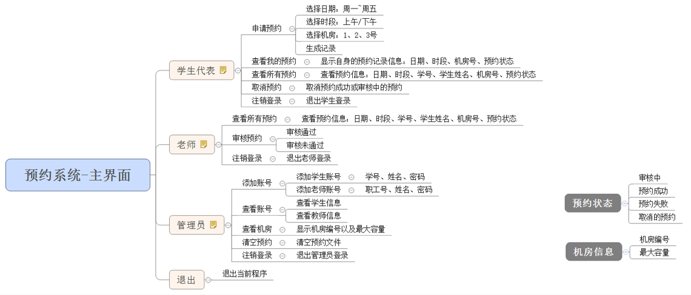

### 机房预约系统
	这个是刚开始学C++时，跟着视频做的项目，由于某次将存档删除了，故重新学习一下，巩固知识。

#### 1.机房预约系统需求

	1.1 系统简介
		学校有几个规格不同的机房，由于使用时经常出现“撞车”现象。现在开发一套机房预约系统同，解决这一问题。
	1.2 身份简介
		* 学生代表：申请使用机房
		* 教师：审核学生的预约申请
		* 管理员：给学生、教师创建账号
	1.3 机房简介
		机房总共有3间
		* 1号机房 --最大容量20人
		* 2号机房 --最大容量50人
		* 3号机房 --最大容量100人
	1.4 申请简介
		* 申请的记录每周由管理员负责清空
		* 学生可以预约未来一周内的机房使用，预约的日期为周一至周五，预约时需要选择预约的时间段（上午、下午）
		* 教师来审核预约，依据实际情况审核预约通过或者不通过
	1.5 系统具体需求
		* 首先进入登陆界面，可选登陆身份有：
			* 学生代表
			* 老师
			* 管理员
			* 退出
		* 每个身份都需要进行验证后，进入子菜单
			* 学生需要输入：学号、姓名、登陆密码
			* 老师需要输入：职工号、姓名、登陆密码
			* 管理员需要输入：管理员姓名、登陆密码
		* 学生具体功能
			* 申请预约 		--预约机房
			* 查看自身的预约 --查看全部预约信息以及预约状态
			* 查看所有的预约 --查看全部预约信息以及预约状态
			* 取消预约		--取消自身的预约、预约成功或审核中的预约均可取消预约
		* 教师具体功能
			* 查看所有的预约 --查看全部预约信息以及预约状态
			* 审核预约		--对学生的预约进行审核
			* 注销登录 		--退出登录
		* 管理员具体功能
			* 添加账号 		--添加学生或教师的账号，需要检测学生编号或教职工号是否重复
			* 查看账号		--可以选择查看学生或教师的全部信息
			* 查看机房		--查看所有机房的信息
			* 清空预约		--清空所有预约记录
			* 注销登录		--退出登录

#### 2.程序流程

	1.	首先进入欢迎界面，让用户输入不同选择，进入不同选项
		0 -- 退出 
		1 -- 增加职工
		2 -- 删除职工
		3 -- 显示所有职工信息
		4 -- 修改职工信息
		5 -- 查找职工
		6 -- 按职工编号进行排序
		7 -- 清空文档
	2. 退出- 退出管理系统
	3. 增加职工，添加新职工，可以批量添加多个职工，职工分为普通员工、经理以及总裁
	4. 删除职工，可以按照职工编号进行删除职工
	5. 显示所有职工信息，先判断文件是否存在或是否清空，如果存在并且有记录的情况下，展示文件内记录内所有职工的信息
	6. 修改职工信息，可以按照用户输入的职工编号，修改职工新的信息，并保存到文件中
	7. 查找职工信息，查找有两种方式，一个按职工编号查找，一个按姓名查找，如果用户查找的内容不为空显示该职工信息，如果为空提示不存在要查找的职工
	8. 按职工编号进行排序，用户可以将输入的所有职工按照职工编号进行升序或者降序排列，并存入文件
	9. 清空文档，可以将文件内当前的记录全部清空。

#### 知识点
	1.面向对象中的封装、继承、多态以及文件IO流
	2.基类、派生类的使用，纯虚函数的实现。
